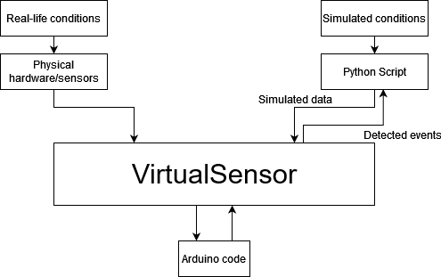
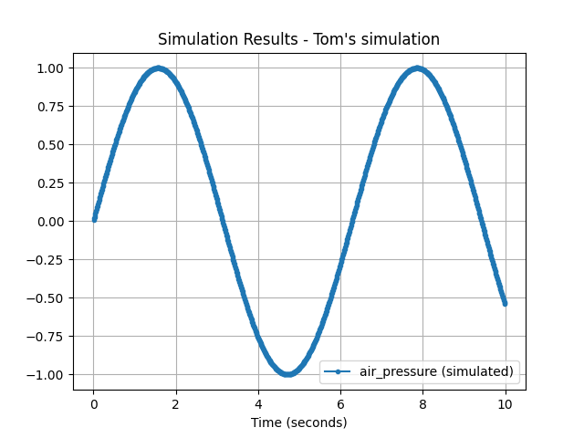
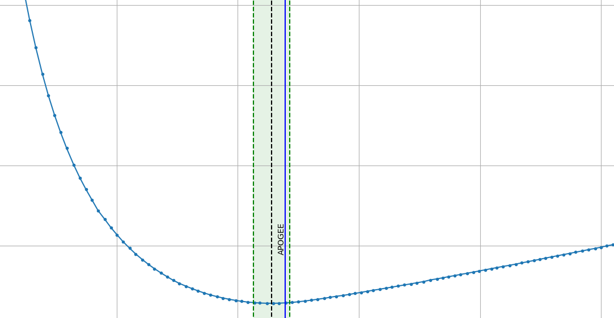

# pyVirtualSensor

Python library to pass simulated data to VirtualSensors and run testing of scenarios that would otherwise be difficult to test

Developed by [Tom Danvers](https://github.com/TomD53)

## Installation

Python 3.9 (not tested on other versions)

git clone https://github.com/TeamSunride/pyVirtualSensor
pip install /path/to/repo

## Explanation

> *This library complements the VirtualSensor library for the Arduino platform (not published yet as of 19/12/2021).*

The term VirtualSensor refers to a layer that sits between physical sensors, and the code that uses their data.
When in test mode, this layer can provide the Arduino with simulated sensor data, which we can use to simulate various
scenarios that would not otherwise be feasible.



In pyVirtualSensor, we refer to the logic that defines what simulated data is sent as a `Simulation`.

This library has been designed in the context of writing code to control a rocket. There are various events during the launch of a rocket that the avionics should respond to. These events include launch, motor burnout, and apogee. The purpose of running simulations is to verify that the algorithms that we write detect these events at the correct times.

Therefore, VirtualSensor contains a framework to detect and analyse such events, which we refer to as `SimulationEvent`s. A `SimulationEvent` is simple; it contains the name of the event, such as "APOGEE", and the time when the event should, or did, occur.

That's great, but there is currently no way of knowing if our rocket detected a `SimulationEvent` at the correct time. This is the purpose of a `SimulationEventGoal`, which contains information about when the event should happen, as well as an acceptable margin of error. If the Arduino detect the event within the margin of error, the goal has been `met`. Otherwise, the goal is `missed`.

## Basic Example

> This example does not include the usage of goals, as they will be shown in a later example. In this example, we respond to any request for simulated data from the Arduino with a value equal to *sin(t)*, where t = the time since the start of our Simulation.

We start by making the necessary imports

```py
from virtualsensor import *
from math import sin
from time import sleep
```

After this, we create a class called `MySimulation` which inherits from `Simulation`. We give it a name, and then override the `get_value` function with our logic to return *sin(t)*. Note the use of the function `self.get_time_elapsed()`, which returns the amount of time since the start of the simulation.

```py
class MySimulation(Simulation):
    name = "Tom's simulation"

    def get_value(self, request):
        time_since_start = self.get_time_elapsed()
        return sin(time_since_start)
```

Then, we create an instance of our simulation, and then create a `VirtualSensorServer`. This is the object that
communicates with the Arduino.


| Argument   | Explanation                                                                                                                |
| ------------ | ---------------------------------------------------------------------------------------------------------------------------- |
| `"COM5"` (str) | Represents the port on our computer which the Arduino is connected to                                                      |
| `["BME280"]` (List[str]) | We pass in a list of sensor names that we want to put into test mode. This will be covered more in the VirtualSensor docs. |
| `simulation` (Simulation) | The instance of our Simulation class. |
| `debug` (bool) | Whether or not to enable debug mode. |
| `serial_monitor` (bool)| Whether or not to print output from the Arduino to the console. |

```py
sim = MySimulation()
server = VirtualSensorServer("COM5", ["BME280"], simulation=sim, debug=False, serial_monitor=False)
```

After this we start the server, wait for 2 seconds for the Arduino to start, then run the simulation for 10 seconds, 
and plot the results on a graph.

```py
server.start()
sleep(2)

sim.start(run_for=10)
server.stop()
sim.plot_results()
plt.show()
```



Source code for this example can be found [here](examples/basic_example.py)

## Advanced Example: Running a simulation with OpenRocket data

```py
from virtualsensor import *

sim = OpenRocketSimulation(
    "../OpenRocketSimulation_SRM_1-5.csv",
    ["APOGEE"],  # this list defines which SimulationEventGoals to extract from the OpenRocket file
    goal_margin=3   # The amount of seconds to define as the time_margin for each auto generated goal
)

server = VirtualSensorServer(
    "COM5",
    ["BME280"],
    simulation=sim,
    serial_monitor=False
)

server.start()
sleep(2)  # wait for Arduino to start

sim.time_scalar = 100  # runs the simulation at 100x speed
sim.start(run_for=500)  # runs the simulation for 500 seconds

server.stop()

sim.plot_results()
plt.show()
```

The blue line represents data being sent to the Arduino from our Simulation. The green line represents the 
region in which we want the rocket to detect Apogee. The blue vertical line shows when the Arduino reported 
Apogee, so we can deem this test as a success.

